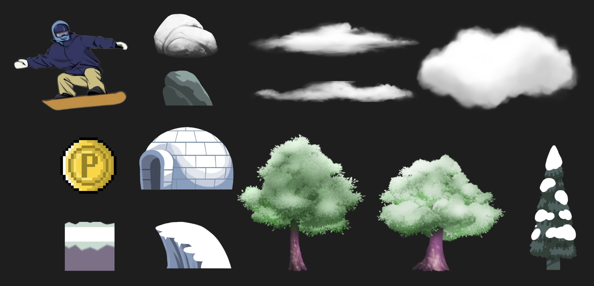
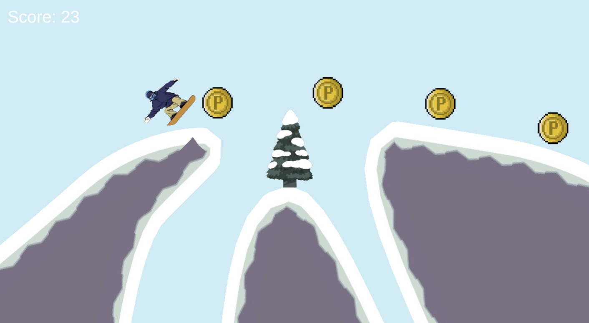
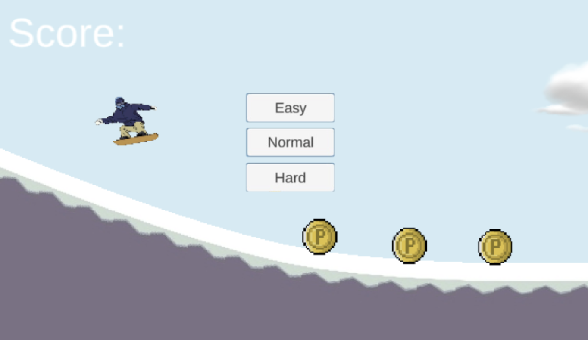
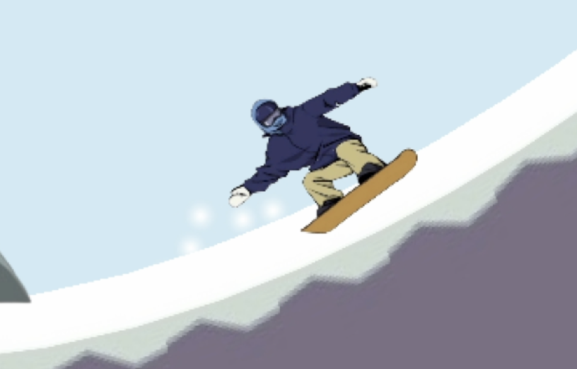
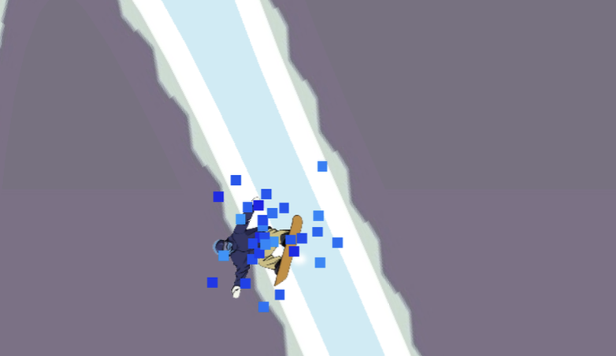

# 2d-skiing-simulator
**Abstract:** 2D Ski Simulator is an engaging winter sports game that challenges players to control a skier down a snowy slope while avoiding obstacles and collecting coins. The game offers three difficulty modes—Easy, Normal, and Hard—each offering a unique level of challenge with varying terrain, obstacles, and speed. Players control the skier’s movements by intuitively tilting left and right, as well as jumping to avoid hazards. The game features dynamic environmental effects, including interactive snow particles and terrain, for added realism. With smooth character animations, varied obstacles, and a variable difficulty curve, 2D Ski Simulator offers a fun and immersive experience for players of all skill levels.
## Setup
```
git clone https://github.com/dungtruong151/2d-skiing-simulator
```

# Table of contents :

1. [Introduction](#introduction)
2. [Features](#feature)
3. [Demo](#demo)
4. [References](#references)

## Introduction <a name="introduction"></a> 
### Group: 2
### Our team member
| Index | Name                   |     ID      |              Email               | Github             |
|:------|:-----------------------|:-----------:|:--------------------------------:|:---------------------------|
| 1     | Trương Trí Dũng (Leader)| ITCSIU21219 | ttdung.work@gmail.com | dungtruong151 |       
| 2     | Nguyễn Huỳnh Thảo My | ITCSIU21204 | thaomypc2003@gmail.com | my003 |
## Features <a name="feature"></a> 
**Main Feature:**  
- Ski Movement Control: The player controls the skier’s movement on the slopes, including steering left or right, adjusting speed, and maintaining balance.
- Obstacle Avoidance: The skier must avoid obstacles such as rocks or trees to stay on course.
- Finish Line Goal: The objective is to reach the finish line by navigating the course successfully without crashing.

**Extra feature:**  
- Tilt-based Control: The skier’s movement is controlled by tilting the device or pressing certain keys, simulating a more immersive experience.
- Jump/Rotation Mechanics: The skier can jump over obstacles and rotate mid-air, allowing for trick moves or avoiding hazards.

##Demo <a name = "demo"></a>
### List of asset component:

### Main playing interface:
- The map is designed with three distinct layers to create a realistic and immersive environment. These narrow gaps and valleys increase the difficulty, requiring players to carefully navigate through them. 

- Easy Mode: A relaxed experience with fewer obstacles, gentler slopes, and slower skier speed, perfect for beginners or casual players.
- Normal Mode: A balanced challenge with moderate obstacles, steeper slopes, and faster speed, requiring quicker reactions and skillful navigation.
- Hard Mode: For experienced players, featuring high speed, frequent obstacles, steeper slopes, and complex terrain, demanding precision and fast reflexes.

#### Effects
- Landing Effects (When Falling from a High Place)

- Head Contact with Snow (Game Over)

## References <a name="references"></a> 
[1] Unity 2D Platformer for Complete Beginners 
https://www.youtube.com/watch?v=TcranVQUQ5U&list=PLgOEwFbvGm5o8hayFB6skAfa8Z-mw4dPV
[2] Physics for a 2D skiing game
https://discussions.unity.com/t/physics-for-a-2d-skiing-game/873674
